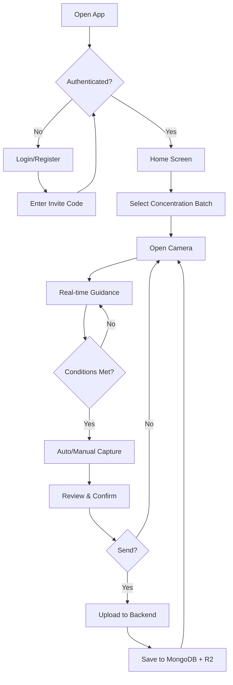

<p align="center">
  
</p>

<h1 align="center">Lateral Flow Scanner</h1>

<p align="center">
  <strong>Enterprise-grade React Native application for precision lateral flow test kit capture and analysis</strong>
</p>

<p align="center">
  
  
  
  
</p>

<p align="center">
  
  
  
</p>

---

## 📋 Table of Contents

- [Overview](#-overview)
- [Key Features](#-key-features)
- [Tech Stack](#-tech-stack)
- [Architecture](#-architecture)
- [Project Structure](#-project-structure)
- [Getting Started](#-getting-started)
- [Workflow](#-workflow)
- [API Documentation](#-api-documentation)
- [Security](#-security)
- [Monitoring](#-monitoring)
- [Screenshots](#-screenshots)
- [Contributing](#-contributing)
- [License](#-license)
- [Contact](#-contact)

---

## 🎯 Overview

**Lateral Flow Scanner** is a professional, enterprise-level mobile application designed to capture high-quality images of lateral flow test kits (e.g., COVID-19, pregnancy tests, drug tests) with full camera sensor control, real-time guidance, and comprehensive metadata collection.

The captured data is intended for training AI models to analyze test results based on test line intensity, enabling automated positive/negative determination.

### Why This App?

| Challenge | Solution |
|-----------|----------|
| Inconsistent image quality | Real-time guidance with exposure, focus, and alignment feedback |
| Missing metadata | Captures 50+ data points including EXIF, sensor readings, and environmental data |
| Manual data entry | Concentration batch presets with auto-fill |
| Uncontrolled capture conditions | Obstruction detection, shake detection, lighting analysis |

---

## 🚀 Key Features

### 📸 Professional Camera System
- **Full Sensor Control** - Exposure, ISO, white balance, focus distance
- **Real-time Frame Processing** - VisionCamera with JSI-based frame processors
- **Auto & Manual Capture** - Intelligent auto-capture when conditions are optimal
- **High-Quality Output** - Original resolution JPEG with preserved EXIF data

### 🎯 Smart Guidance System
- **Border Detection** - Auto-detecting cassette edges with visual guide overlay
- **Alignment Feedback** - Real-time orientation and leveling indicators
- **Quality Warnings** - Blur, exposure, shadow, reflection, obstruction detection
- **Histogram Display** - Live RGB histogram for exposure analysis
- **Exposure Meter** - Visual exposure level indicator

### 📊 Comprehensive Data Collection
- **Camera Metadata** - Make, model, lens, focal length, aperture
- **EXIF Data** - Full EXIF preservation on upload
- **Sensor Readings** - Accelerometer, gyroscope, light, proximity
- **Environmental Data** - Lighting conditions, color temperature
- **Device Info** - OS, model, screen dimensions

### 🔬 Concentration Management
- **Batch Presets** - Pre-define concentration sizes for quick selection
- **Three-Point Access** - Add/edit batches from Home, Capture, or Review screens
- **Auto-Fill** - Selected batch auto-populates capture metadata

### 🔐 Authentication & Security
- **Multi-Provider Auth** - Email/Password, Google OAuth, Facebook OAuth
- **Invite Code System** - Controlled access for new registrations
- **Role-Based Access** - User and Admin roles with different permissions
- **JWT Tokens** - Secure access and refresh token management
- **OTP Verification** - Email-based OTP for account verification and password reset

### 📱 User Experience
- **Offline Queue** - Captures saved locally when offline, auto-synced when online
- **Push Notifications** - FCM-based notifications for important events
- **Dark Mode Ready** - Modern UI with dark mode support
- **Haptic Feedback** - Tactile responses for key actions

---

## 🛠 Tech Stack

### Mobile Application
| Category | Technology |
|----------|------------|
| **Framework** | React Native CLI 0.83 (TypeScript) |
| **Camera** | VisionCamera v4 + Frame Processors |
| **Image Processing** | react-native-fast-opencv |
| **State Management** | Zustand |
| **Data Fetching** | TanStack Query (React Query) |
| **Navigation** | React Navigation v6 |
| **Storage** | MMKV + AsyncStorage |
| **Notifications** | Firebase Cloud Messaging + Notifee |

### Backend Server
| Category | Technology |
|----------|------------|
| **Runtime** | Node.js 20+ |
| **Framework** | Express.js (TypeScript) |
| **Database** | MongoDB Atlas (Mongoose) |
| **Cache** | Redis (Upstash) |
| **Object Storage** | Cloudflare R2 |
| **Message Queue** | Kafka + BullMQ |
| **Authentication** | JWT + bcrypt |
| **Email** | Nodemailer (Brevo SMTP) |
| **Monitoring** | Sentry + Winston |
| **API Docs** | Swagger/OpenAPI |

### Shared Library
| Category | Technology |
|----------|------------|
| **Types** | TypeScript interfaces & types |
| **Validation** | Zod schemas |
| **Utilities** | Shared helpers |

---

## 🏗 Architecture

```
┌─────────────────────────────────────────────────────────────────┐
│                        Mobile App                                │
│  ┌─────────────┐  ┌─────────────┐  ┌─────────────────────────┐ │
│  │   Camera    │  │   Sensors   │  │     State Management    │ │
│  │ VisionCamera│  │ Gyro/Accel  │  │        Zustand          │ │
│  │   OpenCV    │  │ Light/Prox  │  │     React Query         │ │
│  └──────┬──────┘  └──────┬──────┘  └───────────┬─────────────┘ │
│         │                │                      │               │
│         └────────────────┼──────────────────────┘               │
│                          │                                      │
│                    ┌─────▼─────┐                                │
│                    │  API Layer │                               │
│                    │   Axios    │                               │
│                    └─────┬─────┘                                │
└──────────────────────────┼──────────────────────────────────────┘
                           │ HTTPS
┌──────────────────────────▼──────────────────────────────────────┐
│                       Backend Server                             │
│  ┌─────────────┐  ┌─────────────┐  ┌─────────────────────────┐ │
│  │   Express   │  │    Auth     │  │      Controllers        │ │
│  │   Routes    │◄─┤  Middleware │◄─┤   Capture/Stats/Auth    │ │
│  └──────┬──────┘  └─────────────┘  └───────────┬─────────────┘ │
│         │                                       │               │
│  ┌──────▼──────┐  ┌─────────────┐  ┌───────────▼─────────────┐ │
│  │   MongoDB   │  │    Redis    │  │     Cloudflare R2       │ │
│  │   (Atlas)   │  │  (Upstash)  │  │    (Image Storage)      │ │
│  └─────────────┘  └─────────────┘  └─────────────────────────┘ │
│                                                                 │
│  ┌─────────────┐  ┌─────────────┐  ┌─────────────────────────┐ │
│  │    Kafka    │──│   BullMQ    │──│     Background Jobs     │ │
│  │  (Events)   │  │   (Queue)   │  │   (Image Processing)    │ │
│  └─────────────┘  └─────────────┘  └─────────────────────────┘ │
└─────────────────────────────────────────────────────────────────┘
```

---

## 📁 Project Structure

```
LateralFlowScanner/
├── Shared/                          # Shared TypeScript library
│   ├── src/
│   │   ├── types/                   # Common interfaces
│   │   ├── schemas/                 # Zod validation schemas
│   │   └── utils/                   # Shared utilities
│   └── package.json
│
├── LateralFlowScannerBackend/       # Node.js API server
│   ├── src/
│   │   ├── config/                  # Environment, DB, Redis, Kafka
│   │   ├── controllers/             # Route handlers
│   │   ├── middleware/              # Auth, validation, error handling
│   │   ├── models/                  # Mongoose schemas
│   │   ├── routes/                  # API routes
│   │   ├── services/                # Business logic
│   │   ├── jobs/                    # Background workers
│   │   └── utils/                   # Helpers, logger
│   ├── .env.example
│   └── package.json
│
├── LateralFlowScannerMobile/        # React Native app
│   ├── src/
│   │   ├── api/                     # API client & endpoints
│   │   ├── components/              # UI components
│   │   │   ├── Camera/              # CameraView, Controls, Overlays
│   │   │   ├── ConcentrationBatch/  # Batch management
│   │   │   └── UI/                  # Button, Card, etc.
│   │   ├── hooks/                   # Custom hooks
│   │   ├── navigation/              # React Navigation setup
│   │   ├── screens/                 # App screens
│   │   ├── services/                # App services
│   │   ├── store/                   # Zustand stores
│   │   └── utils/                   # Utilities
│   ├── android/                     # Android native code
│   ├── ios/                         # iOS native code
│   └── package.json
│
├── .gitignore
├── LICENSE
└── README.md
```

---

## 🚀 Getting Started

### Prerequisites

- **Node.js** 20+
- **npm** 10+
- **React Native CLI** environment setup ([Guide](https://reactnative.dev/docs/environment-setup))
- **Android Studio** (for Android)
- **Xcode 15+** (for iOS, macOS only)
- **MongoDB Atlas** account
- **Cloudflare R2** bucket
- **Redis** (local or Upstash)

### Installation

```bash
# Clone the repository
git clone https://github.com/chanderbhanswami/Lateral-flow-scanner-app.git
cd LateralFlowScanner

# 1. Build Shared library (required first)
cd Shared
npm install
npm run build

# 2. Setup Backend
cd ../LateralFlowScannerBackend
npm install
cp .env.example .env.development
# Edit .env.development with your credentials

# 3. Setup Mobile
cd ../LateralFlowScannerMobile
npm install

# iOS only
cd ios && pod install && cd ..
```

### Running

```bash
# Terminal 1: Start Backend
cd LateralFlowScannerBackend
npm run dev

# Terminal 2: Start Metro bundler
cd LateralFlowScannerMobile
npx react-native start

# Terminal 3: Run on device/emulator
npx react-native run-android
# or
npx react-native run-ios
```

---

## 🔄 Workflow

### User Journey



### Capture Flow

1. **Pre-Capture** - Select concentration batch, open camera
2. **Guidance** - Real-time feedback on lighting, focus, alignment
3. **Detection** - Auto-detect cassette borders, obstruction check
4. **Capture** - Auto-capture when optimal OR manual trigger
5. **Review** - Preview image, confirm/edit metadata
6. **Upload** - Send image to R2, metadata to MongoDB
7. **Repeat** - Camera reopens for next capture

---

## 📚 API Documentation

### Authentication Endpoints

| Method | Endpoint | Description |
|--------|----------|-------------|
| POST | `/api/auth/register` | Register with invite code |
| POST | `/api/auth/login` | Email/password login |
| POST | `/api/auth/google` | Google OAuth |
| POST | `/api/auth/facebook` | Facebook OAuth |
| POST | `/api/auth/forgot-password` | Request password reset |
| POST | `/api/auth/verify-email` | Verify OTP |

### Capture Endpoints

| Method | Endpoint | Description |
|--------|----------|-------------|
| POST | `/api/captures` | Create new capture |
| GET | `/api/captures` | List user's captures |
| GET | `/api/captures/:id` | Get capture details |
| DELETE | `/api/captures/:id` | Delete capture |

### Concentration Batch Endpoints

| Method | Endpoint | Description |
|--------|----------|-------------|
| POST | `/api/concentration-batches` | Create batch |
| GET | `/api/concentration-batches` | List batches |
| PUT | `/api/concentration-batches/:id` | Update batch |
| DELETE | `/api/concentration-batches/:id` | Delete batch |

Full API documentation available at `/api-docs` when server is running.

---

## 🔐 Security

### Authentication
- **JWT Access Tokens** (7-day expiry)
- **JWT Refresh Tokens** (30-day expiry, stored hashed)
- **Password Hashing** (bcrypt with salt rounds)
- **Account Lockout** (5 failed attempts = 15 min lock)

### Access Control
- **Invite Code Required** for all new registrations
- **Admin Invite Code** for elevated privileges
- **Role-Based Permissions** (user/admin)

### Data Protection
- **HTTPS Only** in production
- **Input Validation** (Zod schemas)
- **SQL/NoSQL Injection Prevention**
- **Rate Limiting** on auth endpoints

---

## 📊 Monitoring

### Error Tracking
- **Sentry** integration for both Mobile and Backend
- Automatic error capture and breadcrumbs
- Performance monitoring

### Logging
- **Winston** structured logging
- **Morgan** HTTP request logging
- Log levels: error, warn, info, debug

### Audit Trail
- **Supabase PostgreSQL** for audit logs
- Tracks user actions, login events, data changes

---

## 📱 Screenshots

<!-- Add screenshots here -->
*Coming soon*

---

## 🤝 Contributing

Contributions are welcome! Please read our contributing guidelines before submitting a PR.

1. Fork the repository
2. Create your feature branch (`git checkout -b feature/AmazingFeature`)
3. Commit your changes (`git commit -m 'Add some AmazingFeature'`)
4. Push to the branch (`git push origin feature/AmazingFeature`)
5. Open a Pull Request

---

## 📄 License

This project is licensed under the MIT License - see the [LICENSE](LICENSE) file for details.

```
MIT License

Copyright (c) 2024 Chanderbhan Swami

Permission is hereby granted, free of charge, to any person obtaining a copy
of this software and associated documentation files (the "Software"), to deal
in the Software without restriction, including without limitation the rights
to use, copy, modify, merge, publish, distribute, sublicense, and/or sell
copies of the Software...
```

---

## 📧 Contact

**Chanderbhan Swami**

- GitHub: [@chanderbhanswami](https://github.com/chanderbhanswami)
- Email: chanderbhanswami29@gmail.com
- LinkedIn: [Chanderbhan Swami](https://linkedin.com/in/chanderbhanswami)

---

<p align="center">
  <strong>Built with ❤️ for precision medical diagnostics</strong>
</p>

<p align="center">
  <sub>If you found this project useful, please consider giving it a ⭐</sub>
</p>